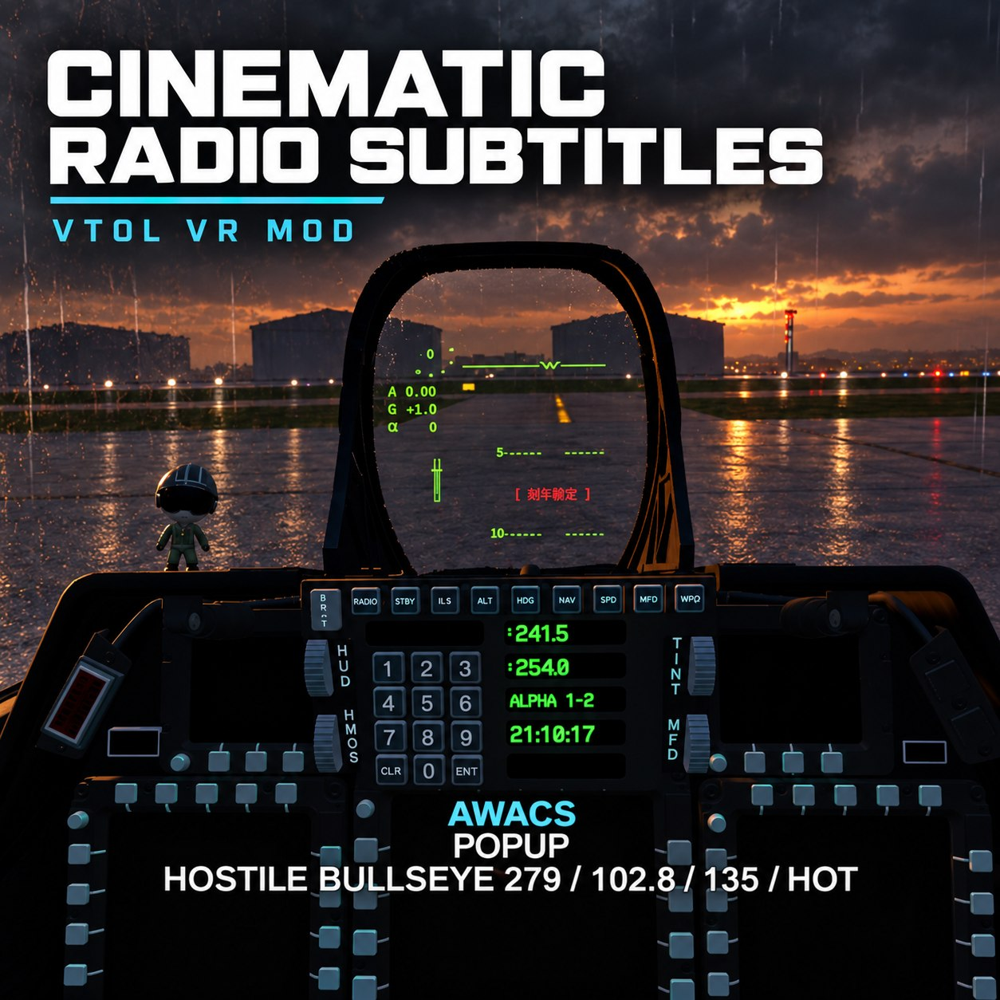

# Cinematic Radio Subtitles

Cinematic Radio Subtitles 是一个仅客户端运行的 VTOL VR Mod Loader 模组，用电影字幕式显示帮助玩家跟上原版英文 NPC 无线电通话。字幕位于 VR 视野中经过立体显示校正的安全区域，不再使用游戏原有的教程标签式显示。

创意工坊：<https://steamcommunity.com/sharedfiles/filedetails/?id=3810788987>

English README: [README.md](README.md)

## v1.1.1

- 塔台、航母 LSO 与 AWACS 字幕
- 扩展普通机场降落分支：拒绝、航线已满、取消请求、联系错误塔台、未获许可落地与落错机场
- 补齐 AWACS 威胁、无法响应和旧版 POPUP 报告路径
- 按阅读时间显示：字幕时长随英文文本量变化；塔台 / LSO 额外增加 2 秒，AWACS 额外增加 4 秒
- 航母降落许可与全部近进 LSO 修正通话
- 两行字幕：彩色说话者标签和当前无线电内容
- 舒适的立体深度，让双眼融合为同一条字幕

## 实现方式

本模组通过精确的 Harmony 补丁挂接游戏的无线电分发方法。支持的 NPC 通话播放时，补丁会取得其参数，并在本模组的 Unity Canvas 叠层中显示对应的英文字幕。

叠层放置在 VR 摄像机前方舒适的虚拟距离，因此会融合成一条字幕而不是左右眼各自显示一份。它绘制在座舱模型前方，且只保留当前通话，避免遮挡飞行视野。AWACS 报告会在适用时采用紧凑的 BRAA / Bullseye 格式，便于快速阅读。

## 无线电挂接对照

[RADIO_HOOKS.md](RADIO_HOOKS.md) 记录了关键无线电方法、对应的原版语音 Clip 列表证据，以及本模组实际显示的英文文本。方法清单来自对当前安装游戏已编译 `Assembly-CSharp.dll` 的静态反编译；它不是 VTOL VR 的源代码，也没有复制游戏源代码。

## 范围与后续计划

本模组仅在客户端运行，不改变任务逻辑、语音音频或多人游戏状态。下一项主要工作是原版僚机无线电：先完成消息映射，再逐项进行游戏内验证。

任务脚本与第三方载具可以只提供任意音频路径，而没有附带文本。这些通话需要作者提供文本，或由模组维护独立的文本映射；仅有音频不足以可靠地产生原版英文字幕。

## 源码与参考

源码：<https://github.com/CMD137/Cinematic-Radio-Subtitles-for-VTOL-VR>

本项目为独立实现，不复用其他模组的源码或 UI。

## 创意工坊封面

`Assets/workshop-cover-v1.0.jpg` 是 v1.0 创意工坊缩略图，大小为 0.24 MB，低于 Steam 的 1 MB 缩略图限制。
